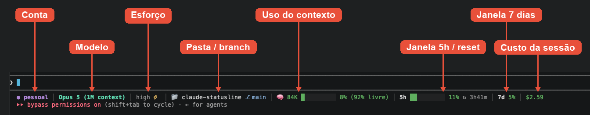

# Statusline adaptativa para Claude Code

Uma barra de status que mostra conta, modelo, esforço, pasta, branch, uso de contexto, limites de 5h/7d e custo da sessão — e que **se ajusta à largura do seu terminal**: uma linha só quando cabe, duas quando não cabe. Nada é truncado nem some na borda.



```
# terminal largo
● trabalho │ Opus 5 (1M context) │ high ⚡ │ 📁 meu-projeto ⎇ main* │ 🧠 47K ████░░░░░░ 31% (69% livre) │ 5h █████░░░░░ 42% ↻ 2h10m │ 7d 28% │ $0.87

# terminal estreito
● trabalho │ Opus 5 (1M context) │ high ⚡ │ 📁 meu-projeto ⎇ main*
🧠 47K ████░░░░░░ 31% (69% livre) │ 5h █████░░░░░ 42% ↻ 2h10m │ 7d 28% │ $0.87
```

A quebra é semântica: **identidade** (conta, modelo, esforço, pasta e branch) na primeira linha, **telemetria** (contexto, limites, custo) na segunda. Em terminais muito estreitos ele continua quebrando em mais linhas, sempre em blocos inteiros.

## Requisitos

- Claude Code **v2.1.153 ou superior** (é a versão que passa a largura do terminal para o script; sem ela a barra funciona, mas sempre em uma linha)
- `jq` **ou** `python3` — para ler o JSON da sessão
- `git` (opcional) — sem ele a barra funciona, só não mostra pasta/branch
- Um terminal com suporte a cores 256 e emoji. Sem emoji, use o modo `ascii` (veja Personalização)

## Instalação

Clone o repositório (ou baixe o ZIP em **Code → Download ZIP**):

```bash
git clone https://github.com/fcandiotti/claude-statusline.git
cd claude-statusline
```

### macOS, Linux e WSL

```bash
bash install.sh
```

### Windows **com** Git Bash (recomendado)

Abra o **Git Bash** na pasta do repositório e rode o mesmo comando:

```bash
bash install.sh
```

O Claude Code executa a statusline pelo Git Bash quando ele está instalado, então esta é a rota preferida no Windows.

### Windows **sem** Git Bash

Abra o **PowerShell** na pasta do repositório:

```powershell
powershell -ExecutionPolicy Bypass -File .\install.ps1
```

Isso instala a versão PowerShell (`statusline.ps1`), que faz a mesma coisa.

O instalador é idempotente: pode rodar de novo quando quiser. Ele faz backup do `settings.json` e da statusline anterior antes de sobrescrever, com carimbo de data/hora.

Não precisa reiniciar o Claude Code — a barra é recalculada a cada atualização de tela.

## O que o instalador faz

1. Copia o script para o seu config dir (`~/.claude/`, ou o que estiver em `CLAUDE_CONFIG_DIR`)
2. Adiciona ao `settings.json`, **preservando todo o resto** (hooks, model, permissions):

```json
"statusLine": {
  "type": "command",
  "command": "bash \"$HOME/.claude/statusline.sh\"",
  "padding": 0
}
```

## Personalização

Tudo por variável de ambiente, exportadas no seu `~/.zshrc`, `~/.bashrc` ou perfil do PowerShell:

| Variável | Efeito |
| --- | --- |
| `CLAUDE_STATUSLINE_STYLE=ascii` | Troca emojis e blocos por ASCII puro (`* ! ~ @ ctx -> # -`), para terminais que não renderizam emoji |
| `CLAUDE_STATUSLINE_LABEL=nome` | Fixa o rótulo de conta em vez de detectá-lo |
| `CLAUDE_STATUSLINE_MARGIN=6` | Colunas reservadas na borda direita (padrão 4). Aumente se a linha ainda encostar na borda; diminua se quebrar cedo demais |

### Rótulo de conta

O primeiro segmento (`● trabalho`) é **opcional e automático**:

- Usa **uma conta só** (`~/.claude`, o padrão)? O segmento simplesmente não aparece — sem configuração, sem erro.
- Usa **mais de uma conta** via `CLAUDE_CONFIG_DIR`? O nome é derivado da pasta: `~/.claude-trabalho` vira `trabalho`, `~/.claude-pessoal` vira `pessoal`. A cor sai de um hash do nome, então cada conta tem uma cor estável e diferente.

### Cores dos indicadores

Contexto e limites mudam de cor sozinhos: **verde** abaixo de 50%, **amarelo** de 50% a 79%, **vermelho** de 80% para cima.

## Testar sem instalar

```bash
echo '{"model":{"display_name":"Opus 5"},"effort":{"level":"high"},"context_window":{"total_input_tokens":47000,"used_percentage":31,"remaining_percentage":69},"rate_limits":{"five_hour":{"used_percentage":42,"resets_at":0},"seven_day":{"used_percentage":28}},"cost":{"total_cost_usd":0.87},"workspace":{"current_dir":"'"$PWD"'"}}' | COLUMNS=90 bash statusline.sh
```

Troque o valor de `COLUMNS` para ver a quebra acontecendo em diferentes larguras.

## Desinstalar

Remova o bloco `"statusLine"` do `settings.json` — ou restaure um dos backups `settings.json.bak-*` que o instalador deixou na mesma pasta.

## Problemas comuns

**A barra sempre fica em uma linha, mesmo estreita.** Seu Claude Code é anterior à v2.1.153 e não exporta `COLUMNS`. Atualize (`claude update`).

**Quadradinhos no lugar dos ícones.** O terminal não tem fonte com emoji: `export CLAUDE_STATUSLINE_STYLE=ascii`.

**"statusline: instale jq (ou python3)".** Falta a dependência de leitura de JSON:
- macOS: `brew install jq`
- Debian/Ubuntu/WSL: `sudo apt install jq`
- Fedora: `sudo dnf install jq`
- Arch: `sudo pacman -S jq`
- Windows: `winget install jqlang.jq`

**Nada aparece no Windows.** Se o caminho no `settings.json` tiver contrabarras (`C:\Users\...`), o Git Bash as consome como escape. Troque por barras normais: `C:/Users/...`.

**A linha ainda encosta na borda direita.** Aumente a margem: `export CLAUDE_STATUSLINE_MARGIN=6`.

## Arquivos do repositório

| Arquivo | Para quê |
| --- | --- |
| `statusline.sh` | A statusline (macOS, Linux, WSL, Git Bash) |
| `install.sh` | Instalador para os mesmos ambientes |
| `statusline.ps1` | Versão PowerShell, para Windows sem Git Bash |
| `install.ps1` | Instalador PowerShell |

## Atualizar

```bash
git pull && bash install.sh
```

O instalador é idempotente e faz backup da versão anterior antes de sobrescrever.

## Licença

MIT — veja [LICENSE](LICENSE).
